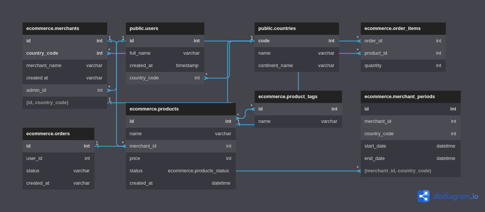

# Simple Commerce Database

## Diagram



## Models

```sql
CREATE TABLE user (
  id integer PRIMARY KEY,
  name text NOT NULL,
  email text NOT NULL,
  password text NOT NULL,
  role text NOT NULL,
  created_at timestamp NOT NULL,
  updated_at timestamp NOT NULL
);

CREATE TABLE category (
  id serial PRIMARY KEY,
  name text NOT NULL,
  description text NOT NULL,
  created_at timestamp NOT NULL,
  updated_at timestamp NOT NULL
);

CREATE TABLE product (
  id serial PRIMARY KEY,
  name text NOT NULL,
  price numeric NOT NULL,
  description text NOT NULL,
  picture text NOT NULL
  category_id integer NOT NULL REFERENCES category (id),
  created_at timestamp NOT NULL,
  updated_at timestamp NOT NULL
);

CREATE TABLE review (
  id serial PRIMARY KEY,
  user_id integer NOT NULL REFERENCES user (id),
  product_id integer NOT NULL REFERENCES product (id),
  rating integer NOT NULL,
  comment text NOT NULL,
  created_at timestamp NOT NULL,
  updated_at timestamp NOT NULL
);

CREATE TABLE warehouse (
  id serial PRIMARY KEY,
  name text NOT NULL,
  description text NOT NULL,
  location text NOT NULL,
  created_at timestamp NOT NULL,
  updated_at timestamp NOT NULL
);

CREATE TABLE inventory (
  id serial PRIMARY KEY,
  stock integer NOT NULL,
  product_id integer NOT NULL REFERENCES product (id),
  warehouse_id integer NOT NULL REFERENCES warehouse (id),
  created_at timestamp NOT NULL,
  updated_at timestamp NOT NULL
);

CREATE TABLE cart (
  id serial PRIMARY KEY,
  user_id integer NOT NULL REFERENCES user (id),
  product_id integer NOT NULL REFERENCES product (id),
  quantity integer NOT NULL,
  created_at timestamp NOT NULL,
  updated_at timestamp NOT NULL
);

CREATE TABLE order (
  id serial PRIMARY KEY,
  quantity integer NOT NULL,
  total_price numeric NOT NULL,
  status text NOT NULL,
  user_id integer NOT NULL REFERENCES user (id),
  product_id integer NOT NULL REFERENCES product (id),
  payment_id integer NOT NULL REFERENCES payment (id),
  shipping_id integer NOT NULL REFERENCES shipping (id),
  created_at timestamp NOT NULL,
  updated_at timestamp NOT NULL
);

CREATE TABLE payment (
  id serial PRIMARY KEY,
  payment_method text NOT NULL,
  amount numeric NOT NULL,
  status text NOT NULL,
  order_id integer NOT NULL REFERENCES order (id),
  created_at timestamp NOT NULL,
  updated_at timestamp NOT NULL
);

CREATE TABLE shipping (
  id serial PRIMARY KEY,
  shipping_method text NOT NULL,
  tracking_number text,
  status text NOT NULL,
  order_id integer NOT NULL REFERENCES order (id),
  created_at timestamp NOT NULL,
  updated_at timestamp NOT NULL
);
```

```go
type Metadata struct {
  CreatedAt time.Time `json:"created_at"`
  UpdatedAt time.Time `json:"updated_at"`
}
```
